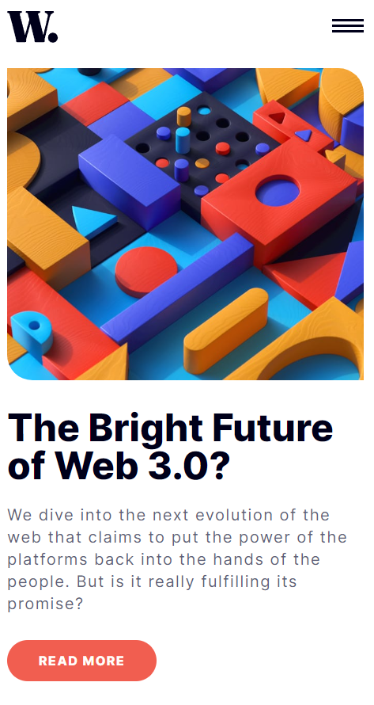

# Frontend Mentor - Página de Notícias

Essa é a minha solução para o desafio [News homepage challenge on Frontend Mentor](https://www.frontendmentor.io/challenges/news-homepage-H6SWTa1MFl)

### O desafio

O usuário deve ser capaz de:

- Ver o layout responsivo compatível com o tamanho da tela
- Ver a mudança do layout com base na pseudo-classe :hover e :focus
- Alternar o menu mobile com o método toggle().

### Minha Solução - Screenshot




### Links
- Solução que eu postei no Frontend Mentor: [@ValeItalo]()
- Meu site: []()


### Criação

- HTML semântico
- Variáveis CSS
- Flexbox
- Grid
- Mobile first
- JavaScript


### O que eu aprendi

Foi uma excelente oportunidade para aplicar meus conhecimentos de CSS Grid, na versão desktop, utilizando media query. 

Por meio de algumas pesquisas eu aprendi a utilizar no JavaScript o método window.matchMedia() para trabalhar com diferentes tamanhos de janela. É o equivalente ao media query do CSS.

```
window.matchMedia("(min-width: 65em)").matches
```

## Autor

- GitHub - [ValeItalo](https://github.com/ValeItalo)
- Frontend Mentor - [@ValeItalo](https://www.frontendmentor.io/profile/ValeItalo)
